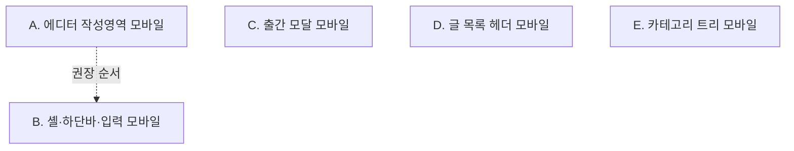

# Epic — 관리자(admin) 영역 모바일 최적화

> **For the next worker:** 이 문서는 세션 맥락이 없는 사람이 읽어도 이해되도록 자기완결적으로 씁니다. 이 에픽은 개인 블로그(ShyLog, Next.js 14 App Router + Tailwind)의 **관리자 페이지들을 폰에서 쓸 수 있게 만드는** 작업을 5개의 독립 이슈로 쪼갠 것입니다. 각 이슈는 `/lead-issue <N>`이 단독으로 집어가 계획·구현·머지까지 진행합니다.

## Epic goal (crystallized requirement)

관리자(admin) 영역 전체를 폰(~360–430px)에서 문제없이 쓸 수 있도록 **반응형 보정**한다. 기존 크래프트 종이 디자인·구조는 유지하고, 데스크톱 전용으로 짜인 부분만 폰에서 깨지지 않게 고친다. 대상:
1. 마크다운 에디터 — 좌우 분할(`preview="live"`) 대신 **작성 우선 + 미리보기 토글**, 툴바 가로 넘침 처리.
2. 출간 모달 — 세로 스크롤 가능(현재 `max-height`/`overflow-y` 없음) + 배경 스크롤 잠금.
3. 에디터 하단 고정 액션바 — 폰에서 한 줄이 넘치지 않게 + iOS 안전영역(`env(safe-area-inset-bottom)`) + 데스크톱 전용 height 매직넘버(`calc(100vh - 260px)`, `pb-[96px]`) 정리.
4. 글 목록 헤더 — 제목 + 3버튼 클러스터가 폰에서 가로로 넘치지 않게 스택/wrap.
5. 카테고리 관리 트리 — 28px 아이콘 버튼 등 작은 터치 타깃과 깊은 들여쓰기로 인한 행 클리핑 보정.

## Context / current state (evidence)

- **루트 레이아웃은 하나**: `app/layout.tsx`. `app/admin/layout.tsx:6`은 pass-through(`<>{children}</>`)라 별도 모바일 스캐폴딩이 없다. 관리자 각 화면이 스스로 반응형을 책임진다.
- **viewport는 이미 정상**: 소스에 명시적 `export const viewport`는 없지만 Next.js가 기본 viewport 메타를 주입한다. 라이브(`https://www.shylog.com`) HTML에서 `<meta name="viewport" content="width=device-width, initial-scale=1">` 확인됨. → **viewport 추가는 이 에픽의 작업이 아니다.**
- **관리자에 반응형 프리픽스가 거의 없음**: admin 트리 + 에디터 컴포넌트에서 `sm:/md:/lg:/xl:` 사용은 사실상 `CategoryAdmin.tsx:332`(편집 폼 그리드)와 `PublishModal.tsx:119`(모달 본문 그리드) 둘뿐. 나머지는 데스크톱 고정.
- **재사용 가능한 기존 모바일 패턴** (공개 측): `components/CategoryDrawer.tsx`(포털 + 슬라이드인 + 바디 스크롤 잠금 `document.body.style.overflow` + Esc + `useFocusTrap`), `@/lib/use-focus-trap`, IME-safe 입력(`TagInput.tsx:40`의 `isComposing`/keyCode 229 가드). 새 UX를 발명하기보다 이 패턴을 참고한다.
- 이미 양호한 화면: `app/admin/login/page.tsx`(`min-h-screen flex ... px-4`, `w-full max-w-sm`, `w-full` 입력) — 반응형이라 이 에픽에서 손대지 않는다.

### 검증된 문제 지점 (issue별 근거)
- 에디터 강제 분할: `components/MarkdownEditor.tsx:49` `preview="live"`. `globals.css`에 `.w-md-editor` 오버라이드 없음 → 라이브러리 기본값이 좁은 화면에서 단일 컬럼으로 안 접히고 두 칸을 반으로 나눔.
- 스크롤싱크: `components/useMarkdownScrollSync.ts`는 두 패널이 동시에 보이는 것을 전제로 `.w-md-editor-area`/`.w-md-editor-preview` scroll을 물림 → 단일 패널 모바일에서는 무의미/역효과.
- 출간 모달: `components/PublishModal.tsx:103` `fixed left-1/2 top-1/2 w-[880px] max-w-[95vw] -translate-x-1/2 -translate-y-1/2` — `max-height`/`overflow-y` 없음. 본문 그리드는 `:119`에서 모바일 세로 스택이라 더 길어져 하단 출간/취소 버튼(`:274-291`)이 화면 밖으로. 배경 스크롤 잠금도 없음.
- 하단 액션바: `components/PostEditorShell.tsx:9-14`(`max-w-[1440px] px-4 pt-10 pb-[96px]` + `fixed inset-x-0 bottom-0` 한 줄 `justify-between`), 액션 내용은 `NewPostForm.tsx:119-131`/`EditPostForm.tsx`(동일 구조)의 `나가기` + `{errorMsg}·임시저장·출간하기`. 에디터 높이 `height="calc(100vh - 260px)"`(`NewPostForm.tsx:138`, EditPostForm 동일)은 데스크톱 상단 여백 기준 매직넘버.
- 글 목록 헤더: `app/admin/posts/page.tsx:45-68` `flex items-center justify-between` + `flex gap-2`의 3버튼(카테고리 관리/+새 글/로그아웃), wrap/스택 없음. **목록 행도 완전히 안전하지는 않음** — `min-w-0`는 바깥 컨테이너(`:91`)에만 있고 제목 링크+상태 배지가 든 안쪽 `flex items-baseline`(`:92`)에는 shrink/`min-w-0`가 없어, 긴 제목이 폰에서 `truncate`되지 못하고 가로로 밀 수 있다. → 목록 페이지 모바일 보정은 헤더뿐 아니라 행까지 함께 본다(Issue D).
- 카테고리 트리: `app/admin/categories/CategoryAdmin.tsx:299` `IconButton` `h-7 w-7`(28px) ×4를 `gap-1` 한 줄(`:252`)에, 들여쓰기 `:220` `paddingLeft: 12 + depth*20`. 편집 폼(`:332`)은 이미 `md:` 스택.
- 보조: 제목 `components/TitleInput.tsx:30` `text-4xl`(폰에서 과대), 태그 삭제 버튼 `components/TagInput.tsx:66` `h-4 w-4`(16px).

## Approach / architecture

전 화면을 한꺼번에 바꾸는 공용 셸을 새로 만들지 않는다(사용자 결정: **디자인 유지 + 반응형 보정**, 모바일 전용 신규 UX 제외). 대신 화면/컴포넌트별로 **Tailwind 반응형 프리픽스와 최소한의 조건부 렌더링**을 더해 각자 폰에서 깨지지 않게 한다. 그 결과 이슈들이 서로 다른 파일을 소유해 **대부분 독립적으로 병렬 진행** 가능하고, 유일한 순서 의존은 에디터 위젯(A)이 자리 잡은 뒤 그 컨테이너(B)를 맞추는 B→A뿐이다.

핵심 설계 결정 (각 근거 명시):
- **에디터 모바일은 "작성 우선 + 미리보기 토글"** — *why:* `MarkdownEditor.tsx:49`의 `preview="live"`가 좁은 화면에서 두 칸을 반으로 갈라 사용 불가. 사용자가 토글 방식을 선택. 단일 패널이 되면 `useMarkdownScrollSync`는 전제(두 패널 동시 표시)가 깨지므로 모바일에서 비활성.
- **출간 모달은 스크롤 컨테이너로 전환** — *why:* `PublishModal.tsx:103`이 세로 중앙 고정인데 높이 상한/스크롤이 없어 폰에서 하단 버튼에 도달 불가. 공개 측 `CategoryDrawer`의 바디 스크롤 잠금 패턴을 참고.
- **하단 액션바는 데스크톱 매직넘버 대신 반응형 높이/래핑 + 안전영역** — *why:* `PostEditorShell.tsx`의 `pb-[96px]`와 폼의 `calc(100vh-260px)`가 데스크톱 여백 기준이라 폰에서 어긋나고, `justify-between` 한 줄이 넘친다.
- **표면별 소유 분리로 병렬화** — *why:* 소유 파일이 겹치지 않으면 `/lead-issue`가 이슈들을 독립적으로(형제 fence만 지키며) 진행 가능. 겹치는 유일한 영역인 "에디터 페이지"는 위젯(A)/셸·입력(B)으로 파일을 갈라 소유 충돌을 없앴다.

**대상 기준:** 폰 우선(~360–430px). 검증은 프로덕션 빌드(`next build && next start`)로 실브라우저 확인 — 개발 모드(`next dev`)는 Fast Refresh가 앱 CSP(`unsafe-eval` 미허용)에 막혀 하이드레이션이 실패하므로 UI 검증에 쓰지 않는다.

## Epic-level Non-goals
- viewport 메타 추가 (이미 정상 주입됨).
- 마크다운 에디터 라이브러리(`@uiw/react-md-editor`) 교체/대체.
- 모바일 전용 신규 UX: 카테고리 **드래그 앤 드롭 재정렬**, 바텀시트, 관리자 전용 모바일 내비 드로어 신설 등.
- 로그인 화면 개편 (이미 반응형).
- 공개(reader) 측(홈/글 상세/카테고리/댓글 등) 변경.
- 서버 액션·DB·인증 로직 변경 (순수 프론트 레이아웃/스타일 작업).
- 데스크톱 레이아웃의 시각적 변경 (반응형 프리픽스로 폰만 조정, `lg:` 이상은 현행 유지).

---

# DAG decomposition (5 issues)

의존은 DAG(순환 없음), 소유 파일 무겹침. 각 이슈는 ~1 PR 규모.

## Issue A — 마크다운 에디터 모바일 (작성 우선 + 미리보기 토글)
- **Goal:** 폰에서 마크다운 에디터가 좌우 분할 대신 작성 화면을 전체 폭으로 보여주고, 버튼으로 미리보기를 토글할 수 있게 한다. 툴바 가로 넘침을 처리하고, 단일 패널 상태에서 스크롤싱크를 비활성한다.
- **Owns:** `components/MarkdownEditor.tsx`, `components/useMarkdownScrollSync.ts`, 그리고 **`app/globals.css`의 에디터 한정 규칙**(`.w-md-editor*` 등 `@uiw/react-md-editor`의 좁은 화면 분할 접기·툴바 overflow 제어용 새 규칙 추가). (에디터 미리보기 렌더러 `MarkdownView.tsx`는 필요 시 읽되 수정하지 않는 걸 기본으로 — 공개 측과 공유됨.)
- **globals.css 펜스:** A는 `app/globals.css`에 **에디터 한정 규칙만 추가**하고, 기존 전역 스타일(`.craft-*`, `.craft-prose*`, hljs, base 등)이나 공개 측에 영향 주는 규칙은 수정하지 않는다.
- **Must NOT touch:** `PostEditorShell.tsx`, `NewPostForm.tsx`, `EditPostForm.tsx`, `TitleInput.tsx`, `TagInput.tsx`(→ Issue B 소유). `PublishModal.tsx`(→ C). `MarkdownView.tsx`의 공개 측 동작.
- **Depends on:** —
- **Acceptance:** 폰 폭에서 에디터가 단일 컬럼(작성)로 뜨고 미리보기 토글이 동작한다. 데스크톱(`md:`↑)에서는 기존 live 분할 유지. 툴바가 화면 밖으로 깨지지 않는다(래핑 또는 가로 스크롤). 단일 패널일 때 스크롤싱크로 인한 튐이 없다. `npm run lint`/`build` 통과, 프로덕션 빌드 실브라우저 확인.

## Issue B — 에디터 셸·하단 액션바·입력 모바일
- **Goal:** 에디터 페이지의 하단 고정 액션바가 폰에서 넘치지 않게(래핑/재배치) 하고 iOS 안전영역을 반영하며, 데스크톱 전용 height 매직넘버를 반응형으로 정리한다. 제목 입력 크기와 태그 삭제 터치 타깃을 폰에 맞춘다.
- **Owns:** `components/PostEditorShell.tsx`, `app/admin/posts/new/NewPostForm.tsx`, `app/admin/posts/[id]/edit/EditPostForm.tsx`, `components/TitleInput.tsx`, `components/TagInput.tsx`. 여기에는 `EditPostForm`이 모달에 넘기는 **`dangerZone` 내용(삭제 버튼) 자체의 마크업·터치 크기**도 포함(모달 프레임/슬롯 배치는 C 소유).
- **Must NOT touch:** `MarkdownEditor.tsx`/`useMarkdownScrollSync.ts`(→ A). `PublishModal.tsx`(→ C, 폼은 모달을 열기만 하고 모달 내부 레이아웃은 건드리지 않음). 서버 액션.
- **Depends on:** — (하드 의존 없음. 소유 파일이 A와 겹치지 않아 독립 진행 가능. 다만 B는 A가 넘겨받는 에디터 height/셸 여백을 조율하므로 **A를 먼저 하면 통합이 매끄럽다** — 순서 권장이지 차단 의존은 아님. A가 아직 안 됐어도 B는 현재 데스크톱 height 계약을 기준으로 착수 가능.)
- **Acceptance:** 폰에서 하단 액션바의 나가기/임시저장/출간하기(+에러 메시지)가 겹치거나 잘리지 않고, iOS 홈 인디케이터 영역을 침범하지 않는다. 에디터 높이가 폰에서 상단 요소 높이에 관계없이 액션바와 겹치지 않는다. 제목이 폰에서 과하지 않은 크기, 태그 삭제 타깃이 손가락으로 누를 만하다. 데스크톱 레이아웃은 시각적으로 동일. lint/build 통과, 프로덕션 빌드 확인.

## Issue C — 출간 모달 모바일 (세로 스크롤 + 배경 잠금)
- **Goal:** 출간 모달이 폰 세로 화면에서 내용이 길어도 스크롤로 모든 필드와 하단 출간/취소 버튼에 도달할 수 있게 하고, 열려 있는 동안 배경 스크롤을 잠근다. 모달 내부 컨트롤(공개설정 토글·업로드/제거 버튼·출간/취소 등)이 폰에서 편히 눌리는 크기인지 함께 본다.
- **Owns:** `components/PublishModal.tsx` — 모달 프레임의 크기/스크롤/배경잠금과 **내부 레이아웃 전체(본문 그리드, 그리고 `dangerZone` 슬롯이 놓이는 위치·스크롤 포함)**. 즉 "슬롯이 어디에 어떻게 배치되고 스크롤되는가"는 C 소유.
- **Must NOT touch:** `NewPostForm.tsx`/`EditPostForm.tsx`(모달 호출부 = B 소유). **`dangerZone`/`categoryPicker`로 넘어오는 *내용(삭제 버튼 등)* 자체는 B/부모 소유** — C는 그 노드를 담는 그릇만 반응형으로 만들고 내용 마크업은 바꾸지 않는다. 모달의 **prop 인터페이스(이름·시그니처)는 유지**. 커버 이미지 업로드 로직(스토리지)·서버 액션은 동작 변경 없이 레이아웃만.
- **Depends on:** —
- **Acceptance:** 폰에서 모달이 뷰포트 높이를 넘으면 내부 스크롤로 `dangerZone`·하단 버튼까지 도달 가능(`max-height` + `overflow-y`). 모달 열림 중 배경 본문이 스크롤되지 않는다. 모달 내부 컨트롤이 폰에서 무리 없이 눌린다. 데스크톱 표시는 기존과 동일. 포커스 트랩/Esc 동작 유지. lint/build 통과, 프로덕션 빌드 확인.

## Issue D — 글 목록 페이지(`/admin/posts`) 모바일
- **Goal:** `/admin/posts` **페이지 전체**를 폰에서 안전하게 만든다. 헤더의 제목 + [카테고리 관리][+새 글][로그아웃] 클러스터가 가로로 넘치지 않게 스택/래핑하고, **목록 행의 긴 제목이 확실히 `truncate`되도록** 안쪽 flex의 shrink/`min-w-0`를 보정한다.
- **Owns:** `app/admin/posts/page.tsx` (헤더 클러스터 + 상태 필터 nav + 목록 행 레이아웃 전부).
- **Must NOT touch:** 다른 admin 페이지/컴포넌트. 목록 조회 쿼리·`logoutAction` 등 서버 액션(레이아웃만, 동작 변경 없음). `Layout.tsx`(공개 셸, 공유).
- **Depends on:** —
- **Acceptance:** 폰에서 (1) 헤더 제목+3버튼이 겹치거나 넘치지 않고(래핑/세로 스택), (2) **아주 긴 제목의 목록 행도 가로로 넘치지 않고 truncate**되며 상태 배지와 편집 링크가 유지된다. 상태 필터 탭 동작 유지. 데스크톱 표시는 시각적으로 동일. lint/build 통과, 프로덕션 빌드 확인.

## Issue E — 카테고리 관리 트리 모바일
- **Goal:** 카테고리 트리 행의 작은 아이콘 버튼(터치 타깃)과 깊은 들여쓰기로 인한 좁은 화면 클리핑을 보정해, 폰에서 이름·순서변경·편집·삭제를 무리 없이 조작할 수 있게 한다.
- **Owns:** `app/admin/categories/CategoryAdmin.tsx`.
- **Must NOT touch:** `app/admin/categories/page.tsx`(공개 `Layout` 사용부), 카테고리 서버 액션(`app/actions/categories.ts`). 드래그 재정렬 도입 금지(비목표) — 기존 up/down 버튼 방식 유지.
- **Depends on:** —
- **Acceptance:** 폰에서 트리 각 행의 조작 버튼이 손가락으로 누를 만한 크기이고, 깊은 depth에서도 이름/버튼이 잘리거나 겹치지 않는다(래핑 또는 들여쓰기 축소). 순서변경/편집/삭제/추가 기능은 기존대로. 데스크톱 표시는 실질적으로 동일. lint/build 통과, 프로덕션 빌드 확인.

## Dependency DAG
하드 의존 없음 — 5개 이슈 모두 소유 파일이 겹치지 않아 독립/병렬 진행 가능. A→B는 통합을 매끄럽게 하는 **권장 순서**일 뿐(점선), 차단 의존이 아니다.

## Recommended execution order
하드 의존이 없으므로 어떤 순서로도(또는 병렬로) 진행 가능. 통합 편의를 위한 권장: **A를 B보다 먼저**. 예: `A → B → C → D → E`, 또는 A 착수 후 C·D·E 병렬 진행, B는 A 이후.
