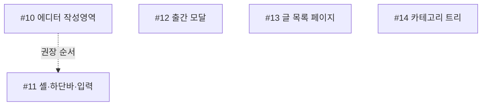

# Epic — 관리자 모바일 최적화 (index)

**상태:** 이슈화 완료 (2026-07-11). 마일스톤 + 5개 자식 이슈 + 트래킹 이슈 생성됨. 각 이슈는 `/lead-issue <N>`로 착수.

- **마일스톤(에픽):** [관리자 모바일 최적화](https://github.com/NJ97S/personal-blog/milestone/1)
- **트래킹 이슈:** https://github.com/NJ97S/personal-blog/issues/15
- **설계 문서:** [design.md](design.md) · **분해 리뷰:** [review.md](review.md) (Verdict: PASS)

## Goal
관리자(admin) 영역 전체를 폰(~360–430px)에서 쓸 수 있게 **반응형 보정**. 크래프트 디자인·구조 유지, 데스크톱 전용으로 깨지는 부분만 수정. viewport(이미 정상)·에디터 라이브러리 교체·모바일 전용 신규 UX(드래그 재정렬 등)·공개 측 변경은 비목표.

## 의존 그래프
하드 의존 없음 — 5개 이슈 모두 소유 파일이 겹치지 않아 독립/병렬 진행 가능. A→B는 통합 편의를 위한 **권장 순서**(차단 아님).



## 자식 이슈 (권장 실행 순서)
| # | 제목 | 소유 파일 | 의존 |
|---|------|-----------|------|
| [#10](https://github.com/NJ97S/personal-blog/issues/10) | 마크다운 에디터 모바일 (작성 우선 + 미리보기 토글) | `MarkdownEditor.tsx`, `useMarkdownScrollSync.ts`, `globals.css`(에디터 한정) | — |
| [#11](https://github.com/NJ97S/personal-blog/issues/11) | 에디터 셸·하단 액션바·입력 모바일 | `PostEditorShell.tsx`, `NewPostForm.tsx`, `EditPostForm.tsx`, `TitleInput.tsx`, `TagInput.tsx` | 권장: #10 이후 |
| [#12](https://github.com/NJ97S/personal-blog/issues/12) | 출간 모달 모바일 (세로 스크롤 + 배경 잠금) | `PublishModal.tsx` | — |
| [#13](https://github.com/NJ97S/personal-blog/issues/13) | 글 목록 페이지(/admin/posts) 모바일 | `app/admin/posts/page.tsx` | — |
| [#14](https://github.com/NJ97S/personal-blog/issues/14) | 카테고리 관리 트리 모바일 | `CategoryAdmin.tsx` | — |

## 실행 (다음 단계)
```
/lead-issue 10
/lead-issue 11   # 권장: 10 이후
/lead-issue 12
/lead-issue 13
/lead-issue 14
```
#12·#13·#14는 병렬 착수 가능.

## 리뷰 히스토리
- review-decomposition 1차: REVISE (B→A 하드의존 근거 약함) → B를 권장 순서로 완화.
- 2차: REVISE (D를 페이지 전체로 확장 + 목록 행 truncate 누락 정정, 모달 dangerZone 슬롯 경계 명시).
- 3차: PASS (+ A에 editor-scoped `globals.css` 허용 보강).
