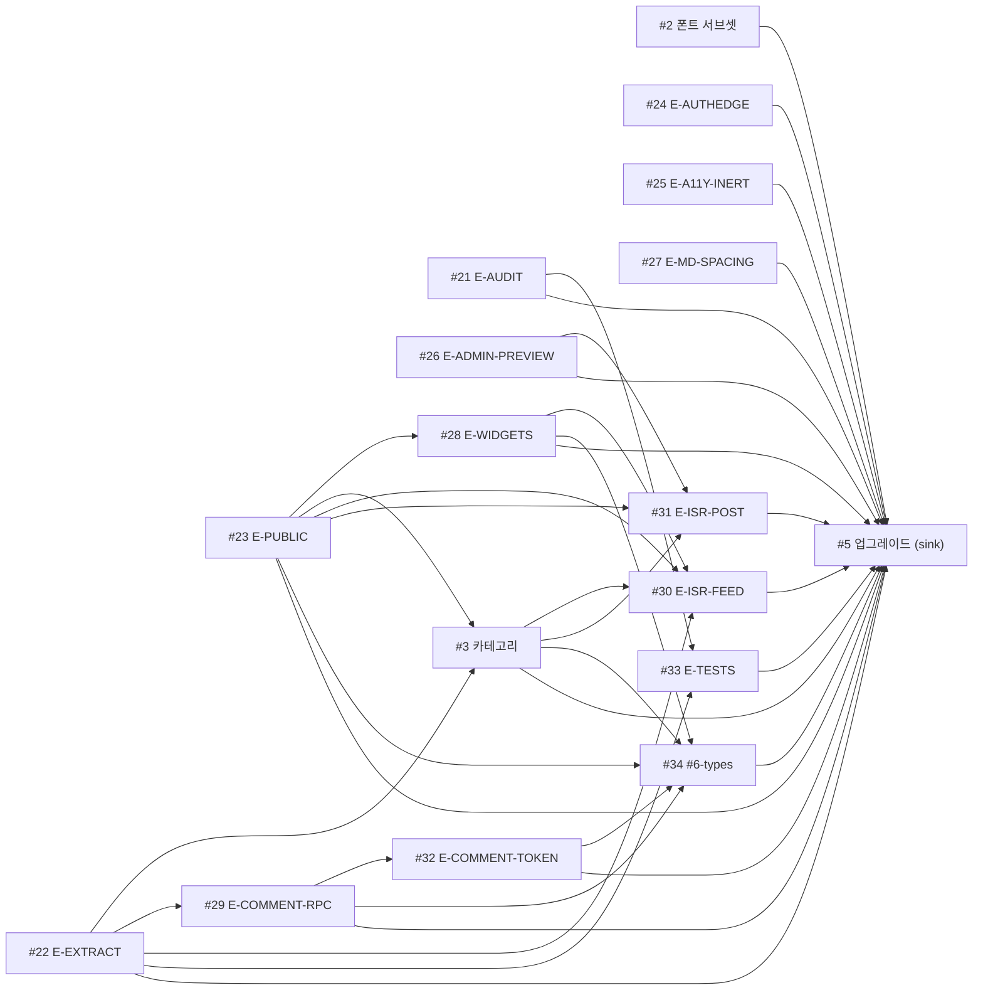

# 에픽 인덱스: 코드베이스 하드닝 — 2026-07 리뷰

> 마일스톤: **Codebase Hardening — 2026-07 review** (#2) · 트래킹 이슈: [#35](https://github.com/NJ97S/personal-blog/issues/35)
> 기준: `main` @ `8166cc4` · 설계: [`design.md`](./design.md) · 리뷰 트레일: [`review.md`](./review.md)

## 목표

현재 `main` HEAD 전체 코드베이스를 정확성·보안·성능·유지보수성/접근성/테스트 4개 축으로 새로 리뷰하고, High 이상 발견사항을 각각 한 PR 규모인 이슈 DAG로 정리했다. 기존 이슈 #2~#7을 흡수(재사용/분할/폐기)했고, Medium/Low는 design.md §6 백로그로만 기록했다. 분해는 7라운드 fresh-eyes 리뷰(`review-decomposition`)를 거쳐 PASS.

## 의존성 DAG

## 자식 이슈 (위상정렬 순서)

| # | 이슈 | 출처 | 의존 |
|---|-------|--------|-----------|
| [#2](https://github.com/NJ97S/personal-blog/issues/2) | perf(fonts): kkukkukk WOFF2 서브셋 | reuse | — |
| [#21](https://github.com/NJ97S/personal-blog/issues/21) | security(deps): non-breaking ws 감사 수정 (E-AUDIT) | new | — |
| [#22](https://github.com/NJ97S/personal-blog/issues/22) | refactor(lib): 테스트 가능한 순수 유틸 추출 (E-EXTRACT) | new | — |
| [#23](https://github.com/NJ97S/personal-blog/issues/23) | feat(supabase): 쿠키리스 public 읽기 클라이언트 (E-PUBLIC) | new | — |
| [#24](https://github.com/NJ97S/personal-blog/issues/24) | fix(auth): 미들웨어 redirect 시 갱신 쿠키 보존 (E-AUTHEDGE) | ← #7 | — |
| [#25](https://github.com/NJ97S/personal-blog/issues/25) | fix(a11y): 닫힘 시 모달/드로어 inert (E-A11Y-INERT) | ← #7 | — |
| [#26](https://github.com/NJ97S/personal-blog/issues/26) | feat(admin): 비공개/초안 글 전용 미리보기 라우트 (E-ADMIN-PREVIEW) | new | — |
| [#27](https://github.com/NJ97S/personal-blog/issues/27) | fix(markdown): 글 본문 표준 읽기 리듬 (E-MD-SPACING) | new (사용자) | — |
| [#28](https://github.com/NJ97S/personal-blog/issues/28) | refactor(widgets): 기본 사이드바 위젯을 public 클라이언트로 (E-WIDGETS) | new | #23 |
| [#3](https://github.com/NJ97S/personal-blog/issues/3) | fix(categories): 트랜잭션 reorder RPC + cross-request 캐싱 | reuse/rescope | #23, #22 |
| [#29](https://github.com/NJ97S/personal-blog/issues/29) | security(comments): anon RPC용 DB-side 남용 차단 (E-COMMENT-RPC) | ← #4 | #22 |
| [#30](https://github.com/NJ97S/personal-blog/issues/30) | perf(routes): 피드 페이지 ISR + 태그 쿼리 바운딩 (E-ISR-FEED) | new | #23, #28, #3, #22 |
| [#31](https://github.com/NJ97S/personal-blog/issues/31) | perf(post): 공개 글 라우트 ISR (Comments + 조회수) (E-ISR-POST) | new | #23, #3, #26 |
| [#32](https://github.com/NJ97S/personal-blog/issues/32) | security(comments): 편집 토큰 만료 + 회전 (E-COMMENT-TOKEN) | ← #4 | #29 |
| [#33](https://github.com/NJ97S/personal-blog/issues/33) | chore(test): 테스트 하네스 + 고가치 테스트 (E-TESTS) | ← #6 | #22, #21 |
| [#34](https://github.com/NJ97S/personal-blog/issues/34) | chore(types): supabase gen types로 타입 있는 클라이언트 | ← #6 | #23, #28, #3, #29, #32 |
| [#5](https://github.com/NJ97S/personal-blog/issues/5) | chore(deps): React 19 + 보안 요구 Next 업그레이드 (sink) | reuse/rescope | 전부 |

대체·폐기: **#4** → #29 + #32 · **#6** → #22 + #33 + #34 · **#7** → #24 + #25.

## 실행

각 노드는 `/lead-issue <N>`으로 구동한다. 위 순서대로 진행하면 의존성이 항상 먼저 착지한다. 루트 8개(#2, #21, #22, #23, #24, #25, #26, #27)는 서로 독립이라 병렬 진행 가능하다.
