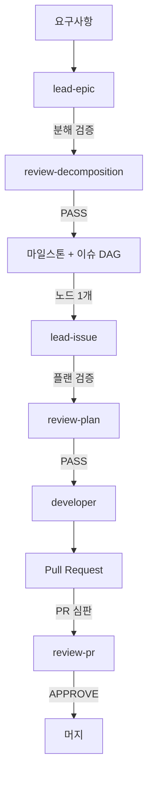

# 워크플로우 가이드 — lead-epic / lead-issue

## What is this

요구사항 하나를 **에픽 → 이슈 DAG → 이슈별 구현 → 머지**까지 끌고 가는 PM 주도 개발 워크플로우입니다. **Claude가 PM**(방향 결정·오케스트레이션·중재)이고, 실제 판단이 필요한 fresh-eyes 작업(분해 리뷰·플랜 리뷰·구현·PR 리뷰)은 **Codex를 독립 프로세스로 스폰**해서 맡깁니다. 컨텍스트를 공유하지 않는 독립 시선이 anchoring bias를 막는 핵심입니다. 전부 로컬 구독 기반이라 추가 결제가 없습니다.

## Roles

| 주체 | 실행 위치 | 담당 스킬 |
|---|---|---|
| **Claude (PM)** | 메인 세션 | `lead-epic`, `lead-issue` |
| **Codex (fresh-eyes / 구현)** | `spawn-agent.sh`로 스폰된 독립 프로세스 | `review-decomposition`, `review-plan`, `developer`, `review-pr` |

## Pipeline



세 개의 fresh-eyes 게이트가 계층별로 놓여 있습니다: 이슈를 만들기 전(`review-decomposition`), 코드를 짜기 전(`review-plan`), PR을 머지하기 전(`review-pr`).

## Skill cards

### 1. lead-epic — 에픽 PM · Claude
- **한 줄:** 요구사항을 큰 그림 설계 → 잘 쪼개진 이슈 DAG(마일스톤=에픽)로 만듭니다.
- **호출:** `/lead-epic "<요구사항>"`
- **핵심 룰:** 깊은 소크라테스 인터뷰로 요구 정제 · 모든 설계 결정은 코드 근거 인용 · PM은 이슈까지만 만들고 플랜/코드는 안 씀 · GitHub 생성은 사용자 승인 게이트 후
- **산출:** 마일스톤 + 에픽 트래킹 이슈(mermaid DAG) + 의존성 링크된 자식 이슈 + `/lead-issue` 실행 순서

### 2. review-decomposition — 분해 심판 · Codex
- **한 줄:** 이슈를 만들기 전에 DAG 분해를 재판합니다.
- **호출:** `spawn-agent.sh --skill review-decomposition --args "<design.md>"` (lead-epic이 스폰)
- **핵심 룰:** 커버리지 갭 · 의존성(사이클·거짓·누락) · 스코프 충돌 · 사이징 · 코드 그라운딩 점검
- **산출(Verdict):** PASS / REVISE / RETHINK

### 3. lead-issue — 이슈 PM · Claude
- **한 줄:** 이슈 하나를 플랜 → 리뷰 → 위임 구현 → PR → 머지까지 9단계로 끌고 갑니다.
- **호출:** `/lead-issue <이슈번호>`
- **핵심 룰:** PM은 방향만 결정, 구현 코드 0줄 · Scope Fence가 법 · 플랜/Developer 경계(플랜에 라인넘버·코드 금지) · 승인 게이트 4곳(Scope Fence·플랜·push·머지)
- **산출:** 머지된 PR + 이슈 문서 폴더

### 4. review-plan — 플랜 심판 · Codex
- **한 줄:** 코드를 짜기 전에 플랜의 전략적 방향을 재판합니다.
- **호출:** `spawn-agent.sh --skill review-plan --args "<plan.md>"` (lead-issue Phase 5가 스폰)
- **핵심 룰:** "코드베이스가 진실, 플랜이 피고인석" · 터치포인트 추출 · blast radius 확장 · gap을 Blocking/Should-document/Observation으로 분류
- **산출(Verdict):** PASS / REVISE / RETHINK

### 5. developer — 구현 · Codex
- **한 줄:** 워크트리 안에서 플랜을 구현하는 유일한 역할.
- **호출:** `spawn-agent.sh --skill developer --cd <worktree> --args "<plan.md> [directive.md]"` (lead-issue Phase 6이 스폰)
- **핵심 룰:** 플랜=WHAT/WHY, HOW는 Developer가 결정 · Scope Fence 벗어나면 에스컬레이션(임의 우회 금지) · 이탈은 사유 문서화 · build/lint 통과 후 커밋
- **산출:** 코드 + 커밋 + `report.md`(Design Decisions 섹션 = PM 중재의 1차 근거)

### 6. review-pr — PR 심판 · Codex
- **한 줄:** PR을 3개 렌즈로 fresh-eyes 리뷰하고 verdict를 게시합니다.
- **호출:** `spawn-agent.sh --skill review-pr --args "<repo> <PR>"` (lead-issue Phase 8이 스폰)
- **핵심 룰:** 3개 렌즈(Correctness&Security / Performance&Robustness / Ecosystem&Coverage) · 적대적 검증(구체적 트리거 없으면 삭제) · **non-blocking 없음(모든 항목 blocking)** · RE-REVIEW 시 리부탈 rigor 심사
- **산출(Verdict):** APPROVE / REQUEST_CHANGES (전부 Resolved/Accepted여야 APPROVE)

## The three fresh-eyes gates

분해·플랜·PR은 각각 **독립 Codex 리뷰어**가 심판합니다. PM(Claude)이 만든 걸 PM이 다시 보면 자기 논리에 갇히니(anchoring), 컨텍스트를 공유하지 않는 별도 프로세스에게 맡깁니다. 특히 `review-pr`은 "사소해서 승인" 같은 걸 구조적으로 막으려고 **리스트에 오른 모든 항목이 blocking**이며, 전부 커밋으로 Resolved되거나 리부탈로 Accepted돼야만 APPROVE합니다.

## How to run

```
/lead-epic "<요구사항>"     # 요구사항 → 마일스톤 + 이슈 DAG
/lead-issue <이슈번호>       # DAG 노드 하나 → 머지
```

`lead-epic`은 요구사항 확정과 GitHub 생성 직전에, `lead-issue`는 Scope Fence·플랜·push·머지 4곳에서 사용자 승인을 받습니다.

## Docs

산출물은 작업별 폴더에 쌓입니다 — `.workflow/docs/epics/<slug>/`, `.workflow/docs/issues/<N>-<slug>/`. **md가 단일 원본(커밋)**, html은 `render-doc.sh`로 렌더된 파생물(gitignore)입니다. 이 가이드도 `/workflow-guide`를 다시 돌리면 각 스킬에서 최신 상태로 재생성됩니다.
